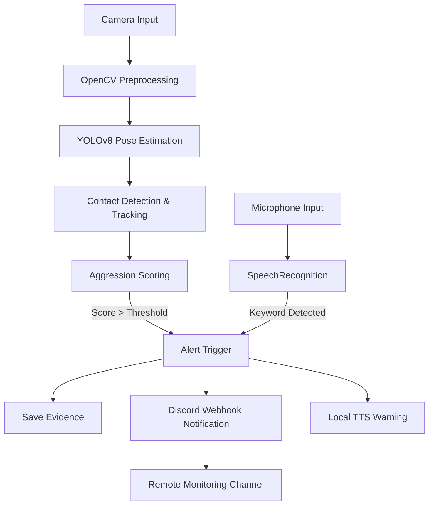

This project integrates **computer vision**, **speech recognition**, and **real-time notifications** to detect aggressive human interactions and send alerts instantly.  
It was **first presented at the Shilin Commercial High School Data Processing Department Project Competition, where it won First Place** 🏆.

---

## 🚀 Features

- **Real-Time Human Pose Estimation** – Powered by [YOLOv8n](https://docs.ultralytics.com/tasks/pose/), running continuously on live camera feeds.  
- **Aggression Scoring & Contact Tracking** – Counts short-term physical contact frequency and calculates aggression scores to reduce false positives.  
- **Voice Integration** – Captures speech via microphone and uses `SpeechRecognition` for speech-to-text; key phrases can trigger alerts.  
- **Local TTS Notifications** – Uses `pyttsx3` to generate immediate voice alerts on-site.  
- **Discord Webhook Integration** – Sends snapshots, scores, and metadata to a dedicated Discord channel for remote monitoring.  
- **Evidence Archiving** – Saves screenshots and event logs for auditing and further analysis.  
- **Extensible Flask API** – Provides endpoints for health checks, log retrieval, and future system integration.

---

## 🛠 Tech Stack

- **Core Model**: YOLOv8n (Ultralytics)  
- **Computer Vision**: OpenCV  
- **Speech-to-Text**: SpeechRecognition  
- **Text-to-Speech**: pyttsx3  
- **Backend & API**: Flask (optional)  
- **Notifications**: Discord Webhook  

---

## 📊 System Architecture

---

## 🏆 Achievements

- **1st Place – Shilin Commercial High School Data Processing Department Project Competition**  
- Successfully demonstrated real-time aggression detection and alerting in a live competition setting.  
- Recognized for its practical application, multi-modal design, and technical robustness.  

---

## 📚 References

- [A human pose estimation network based on YOLOv8 framework with efficient multi-scale receptive field and expanded feature pyramid network – Scientific Reports](https://www.nature.com/articles/s41598-025-00259-0)  
- [Automated violence monitoring system for real-time fist fight detection using deep learning-based temporal action localization – Scientific Reports](https://www.nature.com/articles/s41598-025-12531-4)  
- [Pose Estimation – Ultralytics YOLO Docs](https://docs.ultralytics.com/tasks/pose/)  
- [How to receive webhooks in Python with Flask or Django – LogRocket Blog](https://blog.logrocket.com/receive-webhooks-python-flask-or-django/)  
- [How to Set Up Python Webhooks: 3 Simple Steps – Hevo Data](https://hevodata.com/learn/python-webhook/)  
- [STEAM 教學網：OpenCV 教學索引](https://steam.oxxostudio.tw/category/python/ai/opencv-index.html)  
- [You Only Look Once: Unified, Real-Time Object Detection (CVPR 2016)](https://www.cvfoundation.org/openaccess/content_cvpr_2016/papers/Redmon_You_Only_Look_CVPR_2016_paper.pdf)  
